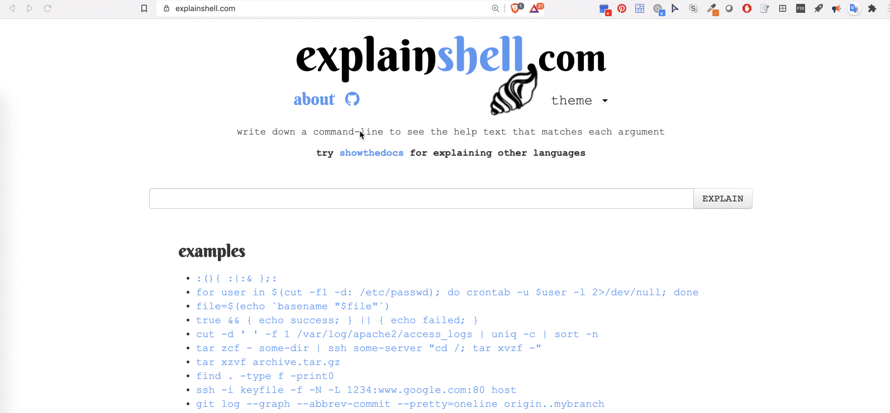

# Using the command line

Useful commands to perform programmatically common operations over files
and folders (create, copy, move, delete, download or navigate folders)


## Utilising the ExplainShell interactive command explorer

There is an excellent resource that provides an interactive command
explainer that can be accessed at <https://explainshell.com/>. Feel free
to use and paste the following commands from the tutorial to see an
explanation of the command based on the official commands documentation.



## 1. List files in the current folder

Directory is used interchangeably with the term folder.

``` bash
ls -l
```


## 2. Inspect your current folder location in the file system 

To see in which folder you are currently in, use the **`pwd`** command,
short fro **`print working dorectory`**. This will return the absolut
path to the location you currently stand.

> NOTE: What is an *absolut* path? And what is not considered an absolut
> path?

See this resource for a thorough explanation:
<https://www.linuxnix.com/abslute-path-vs-relative-path-in-linuxunix/>

``` bash
pwd
```

## 3. Copy a file 

Duplicate the file content while retaining the initial copy

``` bash
cp README.md duplicated_README.md
```

Now let\'s inspect if the file was created, by listing files in the
directory with the `ls -l` command. We are expecting to view the file
with name `duplicated_README.md` in the listed files and folders

``` bash
ls -l
```

# 4. Deleting a file

To delete (remove) a file we can use the command `rm name_of_folder`.
Let\'s delete the duplicate README.md file named `duplicated_README.md`

Now let\'s inspect if the file was created, by listing files in the
directory with the `ls -l` command. We are expecting to **not** view the
file with name `duplicated_README.md` as we just **deleted** it in the
listed files and folders

``` bash
ls -l
```

## 5. Create a new direcctory (folder)

To create a new folder if that folder doesn\'t exist, we can use the
command `mkdir name_of_folder`. Let\'s create a folder named
`new_folder`
"}
``` bash
mkdir new_folder
```


Now let\'s inspect if the folder was created, by listing files in the
directory with the `ls -l` command. We are expecting to view the folder
with name `new_folder` in the listed files and folders

Let\'s inspect the folder exists with our trusted `ls -l` command

``` bash
ls -l
```


## 6. Delete a folder

We can delete a folder using the `rm -r` command:

``` bash
rm -r new_folder
```

``` bash
ls -l
```


## 7. Downloading a file using a link

We can retrieve a file using a public link. For example, we have
uploaded in a public ZENODO record for this course an example file. The
link for the file is:
<https://zenodo.org/record/4302133/files/deseq2_5k.csv>

``` bash
wget https://zenodo.org/record/4302133/files/deseq2_5k.csv
```


-----------------------
# More information

## man pages

By typing `man` before the name of each command, you can get information about how to use them. The manual pages are a set of pages that explain every command available on your system including what they do, the specifics of how you run them and what command line arguments they accept. Some of them are a little hard to get your head around but they are fairly consistent in their structure so once you get the hang of it it's not too bad.To search for something in the man pages, use `/` and then type the search term. To proceed to the next instance of the term, use `n`. To return to the command line, type `q`.

## BASH Commands

There are hundreds of different commands you can use to perform a variety of different functions (hold ESC and press the "y" key for a complete list), but here are a few of the most useful. 

`cd`  
Executed by itself will bring you to your home directory, while adding a path after cd will bring you to that directory. A directory is basically a folder that holds your files or other directories.  

`cd ..`  
Changes directory to one-up the directory hierarchy  

`ls`  
Lists the files and directories in the current directory.

`ls -a`  
Lists the files and directories in the current directory including the hidden (dot) files. `ls -al` will show the files in long form (with their sizes and permissions). However, these sizes are only of the directory itself and do not say how big everything in a directory is. To see this information, use the command `ls -shR`.

`pwd`  
Returns the path to the current directory

`cp file_name path_to_new_directory`  
Copies a file from you current directory and places in a different directory.  

`mv file_name path_to_new_directory`  
Moves the file to a new directory.  

`cat` 
Concatenates files to standard output. Prints the contents of the file on the screen. `cat file1.txt file2.txt > newfile.txt` will concatenate 2 files into a third file.

`head -100 filename`
Prints the first 100 lines of filename to the terminal.

`tail -10 filename`
Prints the last 10 lines of filename to the screen.

`less filename`
Lets you view just a page at a time of a file. After entering this command, the following commands can be used to display a document:
space bar: display the next page,
b: display the previous page,
enter/return: display the next line,
k: display the previous line,
q: quit the viewer

`rm` 
This will remove or delete a file (be careful--cannot undo). 

`mkdir` 
Makes a directory. This is what you call folders when you're in the terminal

`rm -rf` 
Removes a directory and all its contents

control `c` 
Kills the current process

control `z` 
Stops or pauses current process

`fg` 
Resumes last stopped job in the foreground

tab: autocompletes while typing

tab tab: see available autocomplete

`ls -ll` 
Lists the files in a directory as well as their dates and permissions

`du -sh` 
This tells you the disk usage--what is taking up space in a directory

`ls directory | wc -l`
This lets you count the number of files in a directory

`chmod` 
Change permissions

`sed -i -e 's/something/else/g' myfile`
This will replace every instance of "something" with "else" in myfile.

`echo` prints whatever is typed after it. Ex. `echo "text" >file.txt` prints "echo" to a file called file.txt

`exit` 
Disconnect form Colonial One or current node

Once you feel comfortable with these commands and moving around using the command line, you can create and edit files using a text editor like [vim](https://coderwall.com/p/adv71w/basic-vim-commands-for-getting-started) or [nano](https://www.howtogeek.com/howto/42980/the-beginners-guide-to-nano-the-linux-command-line-text-editor/), or [log onto Colonial One](colonialone.md).

For another great tutorial, visit [this](https://molevol.mbl.edu/index.php/UNIX_tutorial) site. For more advanced bash commands [go here](adv_bash.md)
